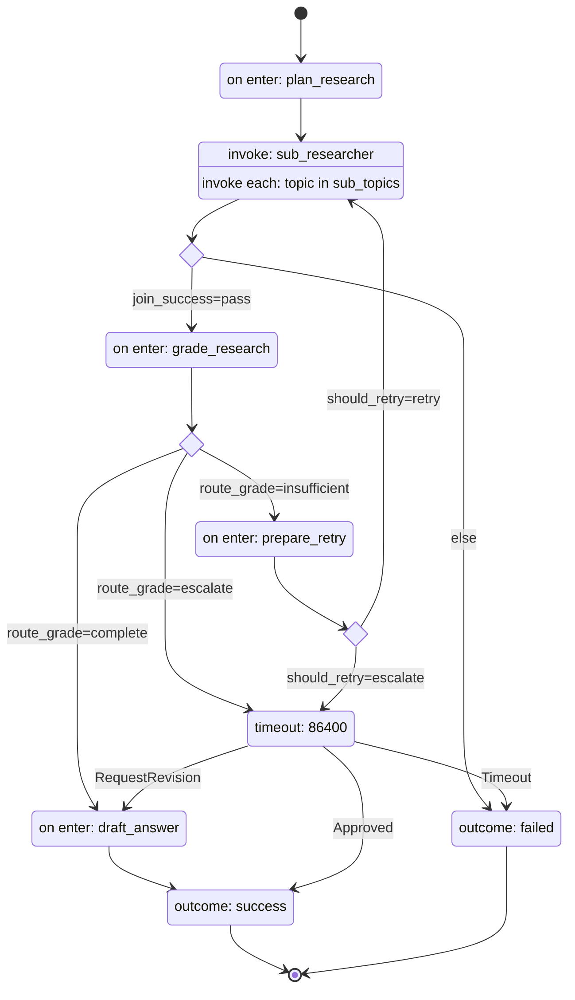

# harel-agents

A reference implementation of a **Parallel Research Agent** built on
[harel](https://github.com/acasadom/harel) — a durable, statechart-driven
orchestrator for LLM agent workflows. Given a question, it plans sub-topics,
researches them in parallel, grades the result, retries with feedback if
needed, drafts a final answer, and optionally waits for human review.

This repo is not a library — it's something to clone and adapt.

## The diagram

This is the entire orchestration logic of the agent, generated straight from
[`research_agent/machines/agent.stm`](research_agent/machines/agent.stm) with
`harel render agent.stm --mermaid` — it can never drift out of sync with what
actually runs.



## Why statecharts for LLM agents

- **Declarative** — the `.stm` file above *is* the orchestration logic:
  states, transitions, retry policy, escalation, all in one place a
  non-engineer can read. Nothing is implied by scattered `if` branches.
- **Durable** — every step is checkpointed. A crash mid-fan-out, or a human
  reviewer who takes 6 hours to respond, doesn't lose state; the execution
  resumes exactly where it left off.
- **Testable** — the engine is pure (no I/O of its own), so the whole
  machine — including the parallel fan-out and the retry loop — is
  unit-tested end to end with zero network calls, via a scripted
  `MockProvider`.

## Quickstart

```bash
git clone <this-repo>
cd harel-agents
uv sync --extra dev

uv run python -m research_agent.run --question "What are the tradeoffs of statecharts for agent orchestration?"
```

That runs the mock provider by default — no API key needed, useful to see the
whole flow work end to end. Ask a real question with a real model:

```bash
uv run python -m research_agent.run \
  --question "What are the tradeoffs of statecharts for agent orchestration?" \
  --provider anthropic --db research.sqlite3
```

`--db` points the runner at a `SqliteStore` file instead of the default
in-memory store. It's optional for a single one-shot question, but it's what
makes an execution parked at `HumanReview` resumable from a *separate* CLI
invocation later (see [Human-in-the-loop](#human-in-the-loop) below).

Run the test suite:

```bash
uv run pytest
```

That's `MockProvider` only — no network, no keys. To also smoke-test the
real Anthropic/OpenAI providers (real network, real cost, needs
`ANTHROPIC_API_KEY`/`OPENAI_API_KEY`), opt in explicitly:

```bash
uv run pytest -m live
```

## Swap providers

Every LLM call in the machine goes through one method:
[`LLMProvider.complete(system, user) -> str`](research_agent/providers/base.py).
`--provider mock` (default) is deterministic and used by the whole test
suite; `--provider anthropic` reads `ANTHROPIC_API_KEY` and calls Claude;
`--provider openai` reads `OPENAI_API_KEY` and calls GPT. None of
[`actions.py`](research_agent/actions.py) — the code that drives the
machine — changes: swapping providers is a CLI flag, not a code change.

## How it works

- **Planning** asks the provider to break the question into sub-topics.
- **Researching** fans out one child execution per sub-topic — in parallel —
  each running the [`sub_researcher`](research_agent/machines/sub_researcher.stm)
  machine to produce a summary. If every child succeeds, the join continues
  to Grading; if any child fails, the whole run routes to `Failed`.
- **Grading** judges whether the collected summaries answer the question:
  `complete` moves on to drafting, `insufficient` goes to refine-and-retry,
  `escalate` parks the run for a human.
- **Refining** records the grader's feedback and increments a retry counter;
  a selector sends the run back to Researching (feedback-guided) if retries
  remain, or escalates to `HumanReview` once `max_retries` is hit.
- **Drafting** synthesizes the final answer from all summaries.
- **HumanReview** is a parked state with a 24-hour durable timeout. It
  reaches `Done` on `Approved`, loops back to `Drafting` on
  `RequestRevision`, or reaches `Failed` if the timeout fires first.

## Human-in-the-loop

When grading escalates — either directly, or after `max_retries` refine
attempts — the run parks at `HumanReview` and the CLI prints the execution
id along with the two commands that can move it forward:

```bash
uv run python -m research_agent.run --approve <execution_id> --db research.sqlite3
uv run python -m research_agent.run --revise  <execution_id> --db research.sqlite3
```

`--approve` moves straight to `Done`. `--revise` sends the run back through
`Drafting` to produce a new answer from the same research. Both are ordinary
CLI invocations in a *new* process — `--db` is what lets them find the
parked execution; the default in-memory store doesn't survive a process
restart.

## vs LangGraph

Full comparison: [`docs/vs-langgraph.md`](docs/vs-langgraph.md).

In short: the `.stm` file is a spec you can read, diff, and statically
validate before running it — not Python code you have to execute to discover
its shape. The parallel fan-out above is 3 lines of DSL; the same pattern in
LangGraph means hand-wiring a `Send` function, a reducer, and a conditional
edge.

## Extend it

**Add a new state** — add a `state` block to `agent.stm` with an `on enter`
action, then add `from`/`select` transitions in and out of it. Run
`harel validate research_agent/machines/agent.stm` to catch unreachable
states or missing branches before running anything.

**Add a new provider** — implement `LLMProvider.complete(system, user) -> str`
(see [`providers/anthropic.py`](research_agent/providers/anthropic.py) for
the shape), add it to `_make_provider()` in
[`run.py`](research_agent/run.py), and add the SDK as an optional dependency
in `pyproject.toml`. Nothing in `actions.py` or the `.stm` files needs to
change.
