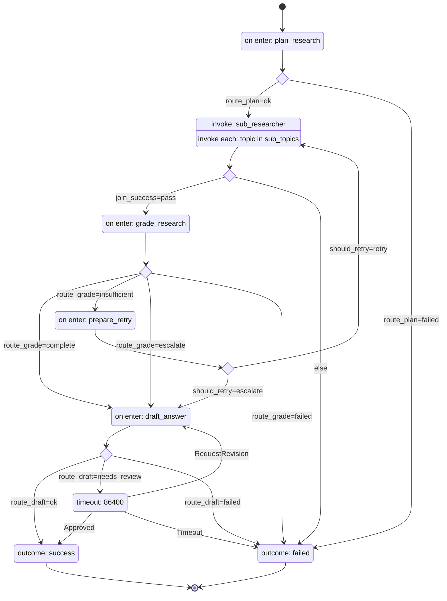

# harel-agents

A reference implementation of a **Parallel Research Agent** built on
[harel](https://github.com/acasadom/harel) — a durable, statechart-driven
orchestrator for LLM agent workflows. Given a question, it plans sub-topics,
fans out research across them, grades the result, retries with feedback if
needed, drafts a final answer, and optionally waits for human review.

This repo is not a library — it's something to clone and adapt.

## The diagram

This is the entire orchestration logic of the agent, generated straight from
[`research_agent/machines/agent.stm`](research_agent/machines/agent.stm) with
`harel render agent.stm --mermaid` — it can never drift out of sync with what
actually runs.



## Why statecharts for LLM agents

- **Declarative** — the `.stm` file above *is* the orchestration logic:
  states, transitions, retry policy, escalation, all in one place a
  non-engineer can read. Nothing is implied by scattered `if` branches.
- **Durable** — every step is checkpointed. A crash mid-fan-out, or a human
  reviewer who takes 6 hours to respond, doesn't lose state; the execution
  resumes exactly where it left off.
- **Testable** — the engine is pure (no I/O of its own), so the whole
  machine — including the fan-out and the retry loop — is
  unit-tested end to end with zero network calls, via a scripted
  `MockProvider`.

## Quickstart

```bash
git clone <this-repo>
cd harel-agents
uv sync --extra dev

uv run python -m research_agent.run --question "What are the tradeoffs of statecharts for agent orchestration?"
```

(`uv run research --question "..."` is a shorter equivalent — the
[`research`](pyproject.toml) console script `uv sync` installs.)

That runs the mock provider by default — no API key needed, useful to see the
whole flow work end to end. To ask a real question with a real model, copy
`.env.example` to `.env` and fill in `ANTHROPIC_API_KEY`/`OPENAI_API_KEY`/
`GROQ_API_KEY` (loaded automatically), or export them in your shell:

```bash
cp .env.example .env   # then edit it

uv run python -m research_agent.run \
  --question "What are the tradeoffs of statecharts for agent orchestration?" \
  --provider anthropic --db research.sqlite3
```

No card on hand? [Groq](https://console.groq.com) has a genuinely free tier
(`--provider groq`, reads `GROQ_API_KEY`) — the easiest way to try a real
model without paying.

`--db` points the runner at a `SqliteStore` file instead of the default
in-memory store. It's optional for a single one-shot question, but it's what
makes an execution parked at `HumanReview` resumable from a *separate* CLI
invocation later (see [Human-in-the-loop](#human-in-the-loop) below).

Run the test suite:

```bash
uv run pytest
```

That's `MockProvider` only — no network, no keys. To also smoke-test the
real Anthropic/OpenAI/Groq providers (real network, needs the matching API
key — Groq's is free) opt in explicitly:

```bash
uv run pytest -m live
```

## Swap providers

Every LLM call in the machine goes through one method:
[`LLMProvider.complete(system, user) -> str`](research_agent/providers/base.py).
`--provider mock` (default) is deterministic and used by the whole test
suite; `--provider anthropic` reads `ANTHROPIC_API_KEY` and calls Claude;
`--provider openai` reads `OPENAI_API_KEY` and calls GPT;
`--provider groq` reads `GROQ_API_KEY` and calls a Groq-hosted open model
over an OpenAI-compatible endpoint — free, and the SDK is just `openai`
pointed at a different `base_url` (see
[`providers/groq.py`](research_agent/providers/groq.py)). None of
[`actions.py`](research_agent/actions.py) — the code that drives the
machine — changes: swapping providers is a CLI flag, not a code change.

## How it works

- **Planning** asks the provider to break the question into sub-topics; a
  malformed plan routes straight to `Failed`.
- **Researching** fans out one child execution per sub-topic — genuinely
  concurrently as of harel 0.2.2 (`asyncio.gather` over the spawns; sync
  actions like `research_topic` each get their own thread-pool slot) —
  running the [`sub_researcher`](research_agent/machines/sub_researcher.stm)
  machine to produce a summary. If *any* child succeeds, the join continues to Grading
  using whatever summaries came back; only if every child fails does the
  whole run route to `Failed`.
- **Grading** judges whether the collected summaries answer the question:
  `complete` moves straight to drafting and `Done`, no human involved.
  `insufficient` goes to refine-and-retry. `escalate` — or a grading call
  that itself failed — also goes to Drafting, but flagged for human review.
- **Refining** records the grader's feedback and increments a retry counter;
  a selector sends the run back to Researching (feedback-guided) if retries
  remain, or flags for review and heads to Drafting once `max_retries` is
  hit.
- **Drafting** synthesizes an answer from the summaries collected so far —
  even on the escalation path, so a human always has something concrete to
  review, never an empty result. It reaches `Done` directly on the normal
  `complete` path, or `HumanReview` on the escalation path.
- **HumanReview** is a parked state with a 24-hour durable timeout — see the
  note below on `--sweep-timers`. It reaches `Done` on `Approved`, loops
  back through `Drafting` (and back to `HumanReview` again) on
  `RequestRevision` — so a draft can be revised more than once — or reaches
  `Failed` if the timeout fires first.

## Human-in-the-loop

When grading escalates — either directly, or after `max_retries` refine
attempts — the run produces a best-effort draft first, then parks at
`HumanReview`, and the CLI prints the execution id along with the two
commands that can move it forward:

```bash
uv run python -m research_agent.run --approve <execution_id> --db research.sqlite3
uv run python -m research_agent.run --revise  <execution_id> --db research.sqlite3
```

`--approve` doesn't need `--provider` — that transition triggers no LLM call.
`--revise` reuses whichever provider produced the original research unless
you pass `--provider` explicitly, and sends the run back through
`Drafting` to produce a new answer from the same research. Both are ordinary
CLI invocations in a *new* process — `--db` is what lets them find the
parked execution; the default in-memory store doesn't survive a process
restart.

`HumanReview`'s 24h timeout is a durable timer, but harel only fires a due
timer when something asks it to — nothing does that automatically here. Run
`--sweep-timers --db research.sqlite3` periodically (e.g. from cron) against
the same `--db` to actually let an unreviewed run time out to `Failed`.

## Watching it run

By default the CLI only prints the final answer (or, on failure, why —
see `_print_failure_reason` in [`run.py`](research_agent/run.py)). To see
what happened at *every* phase, not just the outcome:

```bash
uv run python -m research_agent.run --question "..." --provider groq --db research.sqlite3 -v
```

`-v`/`--verbose` prints the planned sub-topics, each one's research (or its
error, if that sub-topic failed), and the grade — before the final answer.

For the full picture — the statechart tree with the **active state
highlighted live**, and a step-by-step timeline of every transition, action,
and context change — use harel's own TUI. Every execution here records a
trace (`DurableRunner(..., trace=True)` in `_load_runner`) specifically so
this works:

```bash
STM_STORE_DB=research.sqlite3 uv run harel monitor --definitions-dir research_agent/machines
```

(Needs `harel[tui]`, already in the `dev` extra.) `enter` opens an
execution, `↑`/`↓` walks its timeline. This is also the answer to "did the
retry loop / escalation / fan-out failure path actually run, or did the
model just happen to always say complete?" — real questions against a real
provider mostly *do* grade "complete" on the first try (a capable model
usually gets it right), so seeing the other paths exercised for real, rather
than taking it on faith, means either asking something ambiguous enough to
plausibly escalate, or watching the deterministic paths in `tests/test_agent.py`
(which script every branch on purpose) run.

## vs LangGraph

Full comparison: [`docs/vs-langgraph.md`](docs/vs-langgraph.md).

In short: the `.stm` file is a spec you can read, diff, and statically
validate before running it — not Python code you have to execute to discover
its shape. The fan-out above is 3 lines of DSL; the same pattern in
LangGraph means hand-wiring a `Send` function, a reducer, and a conditional
edge.

## Extend it

**Add a new state** — add a `state` block to `agent.stm` with an `on enter`
action, then add `from`/`select` transitions in and out of it. Run
`harel validate research_agent/machines/agent.stm` to catch unreachable
states or missing branches before running anything.

**Add a new provider** — implement `LLMProvider.complete(system, user) -> str`
(see [`providers/anthropic.py`](research_agent/providers/anthropic.py) for
the shape — its SDK-missing guard is one line via
[`providers/base.require_sdk()`](research_agent/providers/base.py)), add it
to `_make_provider()` in [`run.py`](research_agent/run.py), and add the SDK
as an optional dependency in `pyproject.toml`. Nothing in `actions.py` or the
`.stm` files needs to change.

## Editing the `.stm` files

`uv sync --extra dev` also installs `harel[lsp]` and `harel[tui]` (the
[`monitor`](#watching-it-run) dependency), so the
[harel VSCode extension](https://github.com/acasadom/harel/tree/main/editor/vscode)
gets live diagnostics, hover, go-to-definition and a Mermaid preview for
`.stm` files, on top of syntax highlighting (which works with no server at
all). The extension auto-detects this repo's `.venv`; if it doesn't pick it
up, point `harel.pythonPath` at `.venv/bin/python`.
